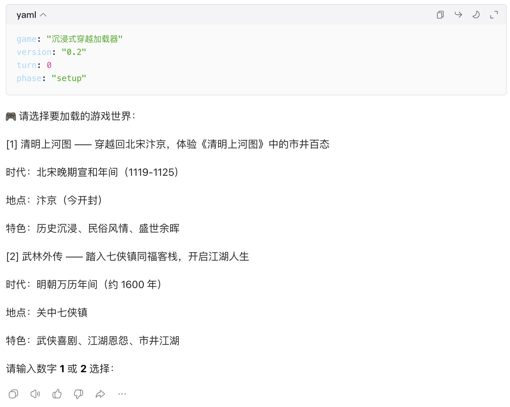
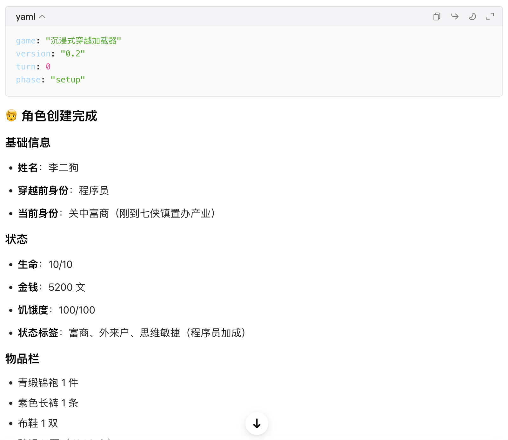
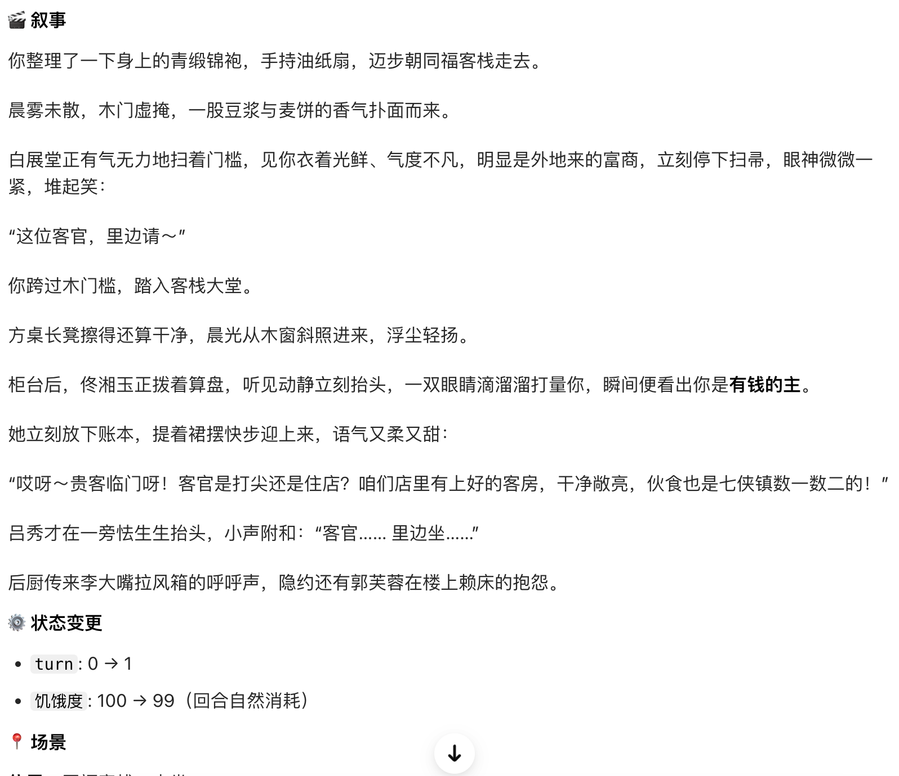

# 🎮 沉浸式穿越加载器

> **一个 Markdown 文件 + LLM = 多世界沉浸式角色扮演体验**

## 📖 项目简介

本项目是一个基于 Markdown 和 LLM 的**沉浸式文本冒险系统**。
不同于传统的文字冒险游戏，本系统没有固定的选项和剧本。你是一个**穿越者**，可以自由选择进入不同的世界：

- 🏮 **北宋汴京** —— 走进《清明上河图》，体验千年前的市井繁华
- ⚔️ **七侠镇** —— 踏入《武林外传》的同福客栈，开启你的江湖人生

时间自然流逝，NPC 自主生活，而你将书写属于自己的穿越故事。

---

## ✨ 核心特性

- **🌍 多世界切换**：一个规则引擎，支持多个世界（清明上河图、武林外传，可扩展）
- **🌏 薛定谔的世界**：你未到达之处皆为虚空，你到达之时 AI 根据时间与规则即时生成
- **⏳ 流动的时间**：游戏时间自然流逝，NPC 会根据时段作息，事件会随时间发酵传播
- **🧑 丰富的 NPC 数据库**：每个世界都有数十到数百个独立角色，有姓名、口音、职业和生活轨迹
- **📜 严格的世界还原**：基于史料或原作，严格遵循服饰、饮食、建筑与礼仪
- **📝 纯 Markdown 驱动**：无需任何代码引擎，复制文件给 AI 即可开始游玩

---

## 🚀 如何开始游玩

### 方法一：完整体验（推荐）

1. **复制文件**：将 `game.md` 和对应的世界文件发送给 AI：
   - 想玩**清明上河图** → 同时发送 `word.md`
   - 想玩**武林外传** → 同时发送 `wulinwaizhuan.md`
2. **输入指令**：发送 **"开始游戏"** 或 `/start`
3. **选择世界**：AI 会询问你想进入哪个世界
4. **创建角色**：回答 AI 提出的身份设定问题
5. **自由探索**：用自然语言与 AI 交互

### 方法二：单世界快速开始

直接发送对应的世界文件 + "开始游戏"：
- 清明上河图：`word.md` + "开始游戏"
- 武林外传：`wulinwaizhuan.md` + "开始游戏"

### 交互示例

```
玩家：我走进城门，看看有什么新鲜事。
玩家：我跟那个剃头匠搭话。
玩家：我等到下午再去茶馆。
玩家：我要使出排山倒海！
玩家：佟掌柜，来一间上房！
```

---

## 📂 文件结构

```text
game-qingming/
├── game.md              # 🎮 系统规则：AI 行为指令、时间机制、回复格式（通用规则层）
├── word.md              # 🏮 清明上河图世界：北宋背景、33场景、56事件、60+NPC
├── wulinwaizhuan.md     # ⚔️ 武林外传世界：明代背景、20场景、40事件、35+NPC
└── README.md            # 📖 项目说明
```

### 文件职责说明

| 文件 | 职责 | 说明 |
| :--- | :--- | :--- |
| **`game.md`** | **规则引擎** | 定义了 AI 如何扮演 DM、时间如何流逝、如何响应玩家指令。此文件通用，可用于加载不同世界。 |
| **`word.md`** | **清明上河图世界** | 北宋汴京世界观、33个地标场景、56个历史事件库及严格的文化约束。 |
| **`wulinwaizhuan.md`** | **武林外传世界** | 明代七侠镇世界观、同福客栈场景、40个经典事件、35+个角色。 |

---

## 🎭 世界介绍

### 🏮 清明上河图

**时代**：北宋晚期宣和年间（1119-1125）
**地点**：汴京（今开封）
**特色**：历史沉浸、民俗风情、盛世余晖

你是《清明上河图》中的一个过客。百万人口的汴京城，汴河两岸的繁华市井，虹桥上的惊险一刻……在这里，你可以：
- 在孙羊正店品尝北宋美食
- 听一场说书先生的三国故事
- 围观虹桥下的漕船险情
- 与胡商交易西域香料
- 体验靖康之变前的最后繁华

**包含**：33个场景、56个事件、60+个NPC

---

### ⚔️ 武林外传

**时代**：明朝万历年间（约1600年）
**地点**：关中七侠镇
**特色**：武侠喜剧、江湖恩怨、市井江湖

你来到了七侠镇的同福客栈。这里有抠门的佟掌柜、胆小的盗圣白展堂、暴躁的郭芙蓉、迂腐的吕秀才……在这里，你可以：
- 入住同福客栈，成为伙计或客人
- 学习葵花点穴手或排山倒海
- 卷入江湖恩怨，见证盗圣传说
- 听邢捕头讲"我滴亲娘哎"
- 在屋顶上谈心赏月

**包含**：20个场景、40个事件、35+个NPC

---

## ⚙️ 系统设计理念

### 1. 规则与数据分离
我们将**规则逻辑**（`game.md`）与**世界内容**（`word.md`, `wulinwaizhuan.md`）彻底分离。这意味着你可以：
- 随时切换不同的世界体验
- 轻松创建新的世界（唐代长安、 medieval 欧洲、赛博朋克 2077）
- 规则文件保持不变，降低扩展成本

### 2. 强制世界加载检查
通过 YAML 元数据追踪当前世界，确保 AI 不会：
- 遗忘当前处于哪个世界
- 混淆不同世界的设定
- 丢失上下文

每次回复前，AI 都会检查并声明：`[世界：xxx | 文件：xxx.md]`

### 3. AI 的角色
AI 不仅仅是讲故事的人，它是：
- **DM（地下城主）**：引导探索，不替玩家做决定
- **世界引擎**：维持时间流逝、事件因果链
- **所有 NPC**：通过严格的 NPC 数据库，确保每个人物的言行符合其身份

---

## 🖼️ 截图/演示

### 启动界面


### 角色创建


### 游戏叙事


---

## 🛣️ 路线图

- [x] 清明上河图世界
- [x] 武林外传世界
- [ ] 唐代长安世界
- [ ] 赛博朋克世界
- [ ] 多人在线版本
- [ ] 可视化界面

---

## 📜 许可与声明

- 本项目数据基于《清明上河图》、北宋史料及《武林外传》相关资料整理
- 本系统仅供娱乐与体验，非严谨历史考证
- 《武林外传》相关内容为粉丝创作，版权归原著作权人所有

---

**🏮 愿你在汴京的烟火气中，或七侠镇的江湖里，找到属于自己的故事。**
